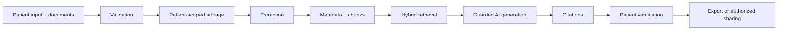

# CareBridge — AI Patient Visit Preparation Assistant

**Arrive prepared. Leave with clarity.**

CareBridge is a full-stack healthcare administration workflow that helps patients organize symptoms, medications, documents, questions, and appointment requirements. It turns patient-approved information into a concise, source-aware visit summary without diagnosing, recommending treatment, or replacing a healthcare professional.

> The public demo uses entirely synthetic information. CareBridge is not a medical device and is not production-certified to handle protected health information.

## Why CareBridge

Visit information is often scattered across memory, medication bottles, portals, referrals, and printed notes. CareBridge creates one calm preparation workspace with an administrative checklist, editable symptom timeline, records library, question builder, pre-visit summary, and post-visit tasks.

## Implemented features

- Responsive patient dashboard and step-based appointment workspace
- Clearly labelled **Appointment Preparation Score**
- Guided symptom capture, provenance labels, and editable timeline
- Medication and reported-allergy organization with safety warnings
- Allowlisted document validation and source-linked record metadata
- Controlled assistant with citations and deterministic clinical-safety refusals
- Editable, version-labelled patient summary with review and PDF export
- Follow-up instruction-to-task drafts requiring patient verification
- Resource-scoped sharing state, revocation, and audit history
- Synthetic end-to-end Maya Thompson demo
- Unit, integration, and adversarial AI-safety tests

The central product is the preparation and follow-up workflow; the assistant is one constrained component.

## Architecture



The runnable demo uses a FastAPI backend, a responsive HTML/CSS/JavaScript client, deterministic demo services, and JSON seed data. The provider-independent service boundaries are ready to evolve toward PostgreSQL/pgvector, object storage, queued document extraction, and a configurable model provider. See [architecture](docs/architecture.md), [data model](docs/data_model.md), [AI safety](docs/ai_safety.md), and [privacy](docs/privacy_design.md).

## Run locally

Prerequisites: Python 3.11+.

```bash
python -m venv .venv
# Windows: .venv\Scripts\activate
# macOS/Linux: source .venv/bin/activate
pip install -r requirements.txt
copy .env.example .env  # Windows; use `cp` on macOS/Linux
uvicorn apps.api.main:app --reload
```

Open `http://localhost:8000`. No login or API key is needed for the synthetic demo.

Run tests:

```bash
pytest
```

Docker:

```bash
copy .env.example .env
docker compose up --build
```

## Demo walkthrough

The demo opens as fictional patient **Maya Thompson**, preparing for a cardiology follow-up on September 18, 2026. Review the preparation score, organize a symptom, validate the sample document in `demo_data/documents`, ask the assistant about follow-up, demonstrate a clinical refusal, approve/export the summary, create follow-up tasks, and inspect sharing/audit history. The detailed script is in [docs/demo_script.md](docs/demo_script.md).

## Safety and trust boundaries

- Non-diagnostic intent and prominent emergency limitation
- Original inputs preserved beside AI-organized wording
- Patient review required before summary sharing
- Citations required for record-derived factual answers
- Explicit patient ownership, expiring grants, revocation, and auditability
- Uploaded content treated as untrusted; it cannot override system policy
- Conservative refusals for diagnosis, treatment, medication changes, or prognosis

## API endpoints

| Endpoint | Purpose |
|---|---|
| `GET /api/demo` | Patient-scoped synthetic workflow data and readiness score |
| `POST /api/assistant` | Guarded, cited administrative answers |
| `POST /api/symptoms/structure` | Preserve and organize patient wording |
| `POST /api/documents` | Validate upload type and size in demo mode |
| `POST /api/follow-ups/extract` | Create unverified task drafts from exact instructions |
| `GET /api/summary.pdf` | Export a synthetic patient-prepared summary |

## Limitations

CareBridge is not a medical device, diagnostic system, emergency service, or substitute for professional care. This portfolio demo is not production-certified for protected health information. It uses in-memory interactions and synthetic JSON rather than durable authentication and storage. Document extraction and AI output can contain errors and always require verification. The demo assistant is deterministic; a production model/RAG provider is intentionally not represented as already implemented.

## Roadmap

Managed PostgreSQL and object storage; clinic and calendar integrations; multilingual and voice entry; stronger accessibility testing; secure messaging; patient-authorized health-record integrations; provider-approved education; document comparison; mobile apps; care-team collaboration.

## Resume-ready description

- Built a full-stack healthcare administration platform for appointment preparation, symptom timelines, medication organization, document readiness, provider questions, summaries, and post-visit follow-up.
- Implemented source-linked assistant patterns, structured outputs, patient-level access boundaries, safety refusals, human verification, sharing revocation, and auditability.
- Added synthetic demo data plus unit, integration, and adversarial evaluations for permission, citation, upload, and medical-safety behavior.

