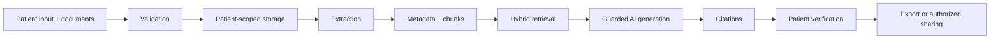

# CareBridge — Applied AI Patient Visit Preparation

**Arrive prepared. Leave with clarity.**

CareBridge is a focused Python, data, and applied-AI portfolio project that helps patients organize symptoms, documents, questions, and appointment requirements. It demonstrates an end-to-end learning path—**Python → NumPy/Pandas/Matplotlib/EDA → SQL → ML → NLP → GenAI/LangChain → RAG**—without hiding the core logic behind a complex web stack.

> The public demo uses entirely synthetic information. CareBridge is not a medical device and is not production-certified to handle protected health information.

## Why CareBridge

Visit information is often scattered across memory, medication bottles, portals, referrals, and printed notes. CareBridge creates one calm preparation workspace with an administrative checklist, editable symptom timeline, records library, question builder, pre-visit summary, and post-visit tasks.

## Skills demonstrated

- **Python:** modular data, NLP, ML, retrieval, and application code
- **NumPy/Pandas/EDA:** preparation scoring, data cleaning, grouped metrics, and symptom analysis
- **Matplotlib:** patient-reported symptom severity visualization
- **SQL:** normalized SQLite schema, synthetic seed data, joins, aggregation, and an in-app read-only query explorer
- **Machine learning:** explainable TF-IDF + logistic-regression document classification
- **NLP:** text normalization, keyword extraction, provenance, and medical-safety intent checks
- **GenAI/LangChain:** optional environment-configured OpenAI generation; no hard-coded model credentials
- **RAG:** local retrieval, model-grounded context, record citations, low-information fallback, and safety refusals
- **Git/GitHub:** clean project structure, tests, documentation, and deployment configuration

The reproducible [EDA notebook](notebooks/carebridge_eda.ipynb) exposes the underlying SQL queries, Pandas frames, NumPy calculation, and Matplotlib visualization.

The central product is the preparation and follow-up workflow; the assistant is one constrained component.

## Architecture



The runnable demo is intentionally simple: Streamlit for presentation, SQLite for storage, scikit-learn for ML/retrieval, and optional LangChain + OpenAI for grounded generation. See [architecture](docs/architecture.md), [AI safety](docs/ai_safety.md), and [privacy](docs/privacy_design.md).

## Run locally

Prerequisites: Python 3.10+.

```bash
python -m venv .venv
# Windows: .venv\Scripts\activate
# macOS/Linux: source .venv/bin/activate
pip install -r requirements.txt
copy .env.example .env  # Windows; use `cp` on macOS/Linux
streamlit run app.py
```

Open the URL printed by Streamlit. No API key is needed for the local retrieval demo. To enable model-backed generation, put `OPENAI_API_KEY` and optionally `OPENAI_MODEL` in `.streamlit/secrets.toml` or your environment.

Run tests:

```bash
pytest
```

## Deployment

Deploy `app.py` from this folder on Streamlit Community Cloud. Set the main file path to `Resume-projects/CareBridge/app.py`; add `OPENAI_API_KEY` as an encrypted secret only if model-backed answers are desired.

## Demo walkthrough

The demo opens as fictional patient **Maya Thompson**. Review Pandas/NumPy metrics, inspect the Matplotlib EDA chart, run the ML classifier, extract NLP keywords, query SQLite, ask the RAG assistant about follow-up, and demonstrate a clinical-safety refusal.

## Safety and trust boundaries

- Non-diagnostic intent and prominent emergency limitation
- Original inputs preserved beside AI-organized wording
- Patient review required before summary sharing
- Citations required for record-derived factual answers
- Explicit patient ownership, expiring grants, revocation, and auditability
- Uploaded content treated as untrusted; it cannot override system policy
- Conservative refusals for diagnosis, treatment, medication changes, or prognosis

## Limitations

CareBridge is not a medical device, diagnostic system, emergency service, or substitute for professional care. The ML model uses a deliberately tiny synthetic training set and its output is demo-only. The local retriever is lexical, not a clinical knowledge system. Model output and document extraction require verification. This build is not production-certified for protected health information.

## Roadmap

Managed PostgreSQL and object storage; clinic and calendar integrations; multilingual and voice entry; stronger accessibility testing; secure messaging; patient-authorized health-record integrations; provider-approved education; document comparison; mobile apps; care-team collaboration.

## Resume-ready description

- Built a full-stack healthcare administration platform for appointment preparation, symptom timelines, medication organization, document readiness, provider questions, summaries, and post-visit follow-up.
- Implemented source-linked assistant patterns, structured outputs, patient-level access boundaries, safety refusals, human verification, sharing revocation, and auditability.
- Added synthetic demo data plus unit, integration, and adversarial evaluations for permission, citation, upload, and medical-safety behavior.
