# CareBridge architecture

```mermaid
flowchart LR
  A[Patient input and documents] --> B[Schema and file validation]
  B --> C[(Patient-scoped storage)]
  C --> D[Document extraction]
  D --> E[Metadata and source chunks]
  E --> F[Hybrid retrieval]
  F --> G[Safety guard + structured generation]
  G --> H[Citation mapping]
  H --> I[Patient review and approval]
  I --> J[PDF export or authorized sharing]
```

The portfolio application deliberately uses a compact stack: Streamlit UI, SQLite/SQL storage, Pandas and NumPy analytics, Matplotlib export, scikit-learn retrieval, and optional Groq answer composition. This keeps every data and AI step inspectable.

Every retrieved chunk must include `patient_id`, `appointment_id`, document, page, and section metadata. Authorization is applied before retrieval and again before returning citations. Generated wording never overwrites the original source.
