# CareBridge architecture

```mermaid
flowchart LR
  A[Patient input and documents] --> B[Schema and file validation]
  B --> C[(Patient-scoped storage)]
  C --> D[Document extraction]
  D --> E[Metadata and source chunks]
  E --> F[Hybrid retrieval]
  F --> G[Safety guard + structured generation]
  G --> H[Citation mapping]
  H --> I[Patient review and approval]
  I --> J[PDF export or authorized sharing]
```

The runnable portfolio demo uses FastAPI with a static responsive client and deterministic synthetic data. The service layer is provider-independent and demonstrates the key trust boundaries without sending sensitive data to a model. A production deployment would replace JSON demo storage with PostgreSQL, object storage, background extraction, and patient-filtered vector retrieval.

Every retrieved chunk must include `patient_id`, `appointment_id`, document, page, and section metadata. Authorization is applied before retrieval and again before returning citations. Generated wording never overwrites the original source.

