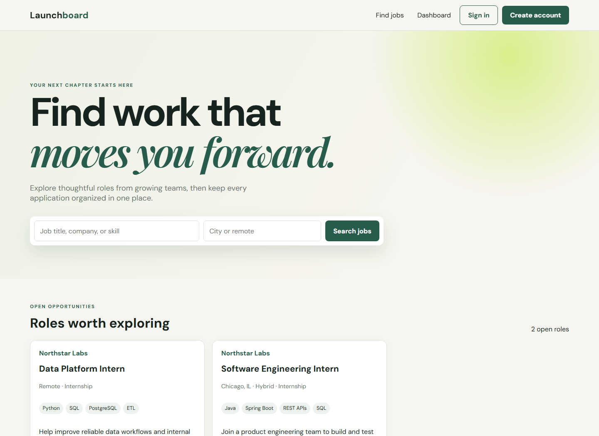

# Job Portal — Full-Stack Recruiting Platform

Launchboard is a full-stack recruiting application with separate candidate and recruiter workspaces. Candidates can discover jobs, maintain a profile, upload a resume, apply, and track progress. Recruiters can manage companies and job posts, review applicants, update hiring stages, and monitor recruiting activity.

The application uses a layered Spring Boot architecture, a responsive vanilla JavaScript frontend, PostgreSQL persistence, BCrypt password hashing, and signed JWT authentication.

## Live Demo

**Web application:** https://launchboard-job-portal.onrender.com

The free Render service can take a short time to wake after inactivity.

Sample accounts:

| Role | Email | Password |
|---|---|---|
| Candidate | `candidate@example.com` | `Password123!` |
| Recruiter | `recruiter@example.com` | `Password123!` |

## Why Launchboard

Job searches and recruiting pipelines often become scattered across job boards, email, spreadsheets, resumes, and disconnected status updates. Launchboard brings the core workflow into one application:

- Candidate and recruiter accounts
- Searchable job listings
- Candidate profile and resume management
- Applications and status tracking
- Company and job-post management
- Applicant review and stage updates
- Recruiting analytics

## Core Workflow

### 1. Authentication and Access

Users register as a candidate or recruiter and sign in with email and password. Passwords are hashed with BCrypt, and the API returns an expiring signed JWT. Spring Security protects candidate and recruiter endpoints by role.

### 2. Live Job Discovery

Candidates search current remote openings supplied by the Remotive public jobs API alongside roles published directly by Launchboard recruiters. Every external listing is source-labeled and links to its original application page. A short server-side cache limits upstream requests, and the local PostgreSQL feed remains available if the external provider is temporarily unreachable.

### 3. Candidate Workspace

Candidates can:

- Build and update a profile
- Record a headline, location, skills, and professional summary
- Upload PDF, DOC, or DOCX resumes up to 5 MB
- Apply to open positions
- Track application stages

The database prevents the same candidate from applying to the same job more than once.

### 4. Recruiter Workspace

Recruiters can:

- Create and manage company profiles through the API
- Publish, update, and close job postings
- Review applicants across company jobs
- Search by candidate name, email, or job title
- Filter applications by hiring stage
- Move candidates through Applied, Reviewing, Interview, Offer, or Rejected stages

Ownership checks prevent recruiters from modifying another recruiter's jobs or applications.

### 5. Recruiting Analytics

The recruiter dashboard summarizes total applications and stage counts, including applications under review, interviews, and offers.

## Security Design

Launchboard includes:

- BCrypt password hashing
- Signed HS256 JWT access tokens
- Eight-hour token expiration by default
- Candidate and recruiter role authorization
- DTO validation and centralized error responses
- Resume type and size restrictions
- Environment-based database credentials and signing secrets
- Recruiter ownership checks in the service layer

Production use would additionally require email verification, password recovery, refresh-token rotation, rate limiting, malware scanning, private object storage, audit logs, and formal security review.

## Technology

- Java 21
- Spring Boot 3.5
- Spring Web and REST APIs
- Spring Data JPA and Hibernate
- Spring Security and JWT
- RestClient integration with the Remotive jobs API
- PostgreSQL and H2
- HTML, CSS, and JavaScript
- OpenAPI and Swagger UI
- Maven, JUnit, Mockito, and MockMvc
- Docker and Render

## Project Structure

```text
job-portal/
├── src/
│   ├── main/
│   │   ├── java/com/nishita/jobportal/
│   │   │   ├── config/
│   │   │   ├── controller/
│   │   │   ├── dto/
│   │   │   ├── entity/
│   │   │   ├── exception/
│   │   │   ├── repository/
│   │   │   └── service/
│   │   └── resources/
│   │       ├── static/
│   │       └── application.yml
│   └── test/
├── docs/
├── postman/
├── Dockerfile
├── compose.yml
├── pom.xml
└── README.md
```

Detailed decisions are documented in [`docs/architecture.md`](docs/architecture.md).

## Application Preview



## Local Setup

From the Job Portal directory:

```bash
cd Resume-projects/job-portal
```

Windows PowerShell:

```powershell
.\mvnw.cmd spring-boot:run
```

macOS or Linux:

```bash
./mvnw spring-boot:run
```

Open http://localhost:8080. The default configuration uses an in-memory H2 database and fictional sample data.

Run the tests:

```bash
./mvnw test
```

## PostgreSQL Configuration

Set these environment variables:

```text
DATABASE_URL=jdbc:postgresql://localhost:5432/jobportal
DATABASE_USERNAME=jobportal
DATABASE_PASSWORD=your-password
JWT_SECRET=replace-with-at-least-32-random-characters
DDL_AUTO=update
```

Or run the application and PostgreSQL together:

```bash
docker compose up --build
```

## API Documentation

After starting the application:

- Swagger UI: http://localhost:8080/swagger-ui.html
- OpenAPI JSON: http://localhost:8080/v3/api-docs
- Postman collection: [`postman/Job-Portal.postman_collection.json`](postman/Job-Portal.postman_collection.json)

Protected requests use `Authorization: Bearer <token>`.

## Deployment

The live application is deployed as a Docker web service on Render with a dedicated PostgreSQL database. Render builds the `Resume-projects/job-portal` monorepo directory and automatically redeploys changes pushed to `main`.

Production environment variables are stored in Render and are not committed to GitHub.

## Limitations

- This is a portfolio MVP, not a production applicant-tracking system.
- Resume files use local storage; production should use private object storage.
- Sample accounts and recruiter-created seed data are fictional; external listings are supplied by Remotive and may change or expire.
- Refresh-token rotation, password recovery, and email verification are not implemented.
- Free hosting may sleep during inactivity and has limited database capacity.

## Resume Bullet

Built and deployed Launchboard, a full-stack recruiting platform using Java, Spring Boot, PostgreSQL, Spring Security, and JWT, integrating a cached live jobs API with role-specific candidate and recruiter workflows, resume uploads, application tracking, hiring-stage management, analytics, documented REST APIs, and automated tests.

## Author

**Nishita Reddy Yaduguri**  
Computer Science and Data Science, University of Wisconsin–Madison
