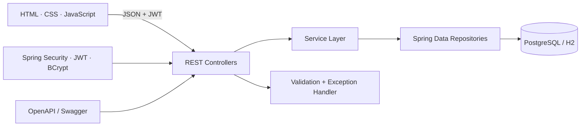
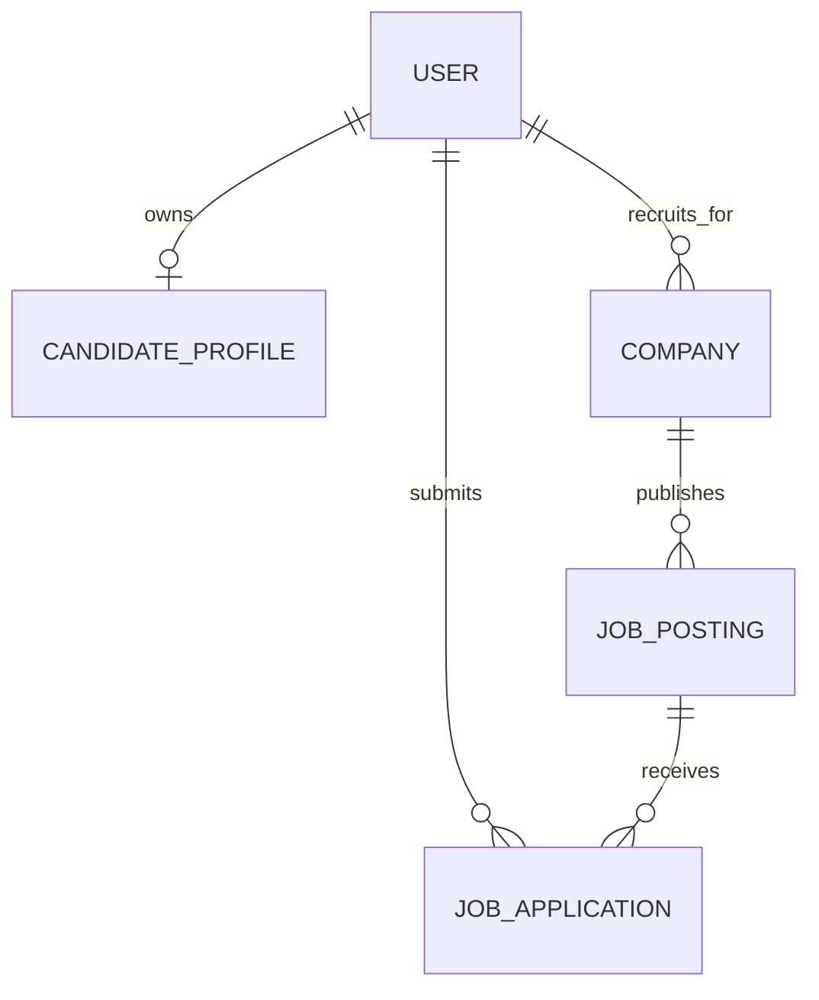

# Job Portal — Full-Stack Recruiting Platform

Launchboard is a production-style recruiting application with separate candidate and recruiter experiences. Candidates discover jobs, maintain a profile, upload a resume, apply, and track progress. Recruiters manage companies and job posts, review applicants, move candidates through hiring stages, and monitor recruiting activity.

   

## Product highlights

- Responsive HTML, CSS, and JavaScript interface served by Spring Boot
- Candidate and recruiter registration, login, and role-specific workspaces
- BCrypt password hashing and signed JWT bearer authentication
- Job search across title, company, skills, and location with pagination and sorting
- Candidate profiles, PDF/DOC/DOCX resume upload, applications, and status tracking
- Company profiles, job publishing and closure, applicant pipelines, and analytics
- Layered controllers, services, repositories, entities, and DTOs
- Consistent validation, HTTP status codes, and centralized exception responses
- OpenAPI/Swagger documentation and a ready-to-import Postman collection
- H2 development database with PostgreSQL configuration for deployment

## Screens

The public landing page is designed around job discovery. Authentication unlocks one of two dashboards:

1. **Candidate workspace** — profile, resume, applications, and status history
2. **Recruiter workspace** — analytics, job management, applicants, and hiring stages


## Architecture



```text
src/main/java/com/nishita/jobportal/
├── config/       Security, OpenAPI, and sample data
├── controller/   Candidate, recruiter, job, and auth REST APIs
├── dto/          Validated API request and response contracts
├── entity/       Relational JPA domain model
├── exception/    Consistent error handling
├── repository/   Spring Data queries and pagination
└── service/      Business rules and authorization boundaries
```

## Data model



The database enforces unique emails and one application per candidate per job. Recruiter service methods also verify ownership before editing a company job or changing an application stage.

## Run locally

Requirements: Java 21 and Maven 3.9+, or Docker Desktop.

```bash
git clone https://github.com/Nishita2006/applied-ai-data-portfolio.git
cd applied-ai-data-portfolio/Resume-projects/job-portal
./mvnw spring-boot:run
```

On Windows, use `mvnw.cmd spring-boot:run`. Open http://localhost:8080.

Sample accounts:

| Role | Email | Password |
|---|---|---|
| Candidate | `candidate@example.com` | `Password123!` |
| Recruiter | `recruiter@example.com` | `Password123!` |

The default configuration uses an in-memory H2 database. For PostgreSQL:

```powershell
$env:DATABASE_URL="jdbc:postgresql://localhost:5432/jobportal"
$env:DATABASE_USERNAME="jobportal"
$env:DATABASE_PASSWORD="your-password"
$env:JWT_SECRET="replace-with-at-least-32-random-characters"
./mvnw spring-boot:run
```

Or start the complete application and PostgreSQL stack:

```bash
docker compose up --build
```

## API documentation

After starting the app:

- Swagger UI: http://localhost:8080/swagger-ui.html
- OpenAPI JSON: http://localhost:8080/v3/api-docs
- Postman: import [`postman/Job-Portal.postman_collection.json`](postman/Job-Portal.postman_collection.json)

Important endpoint groups:

| Area | Endpoints |
|---|---|
| Authentication | `POST /api/auth/register`, `POST /api/auth/login` |
| Public jobs | `GET /api/jobs`, `GET /api/jobs/{id}` |
| Candidate | `/api/candidate/profile`, `/resume`, `/applications` |
| Recruiter | `/api/recruiter/companies`, `/jobs`, `/applications`, `/analytics` |

Protected requests use `Authorization: Bearer <token>`.

## Tests

```bash
./mvnw test
```

The test suite includes service-level business-rule coverage and Spring Boot/MockMvc integration tests for public job search, JWT login, candidate API access, and role isolation.

## Deployment

The included multi-stage `Dockerfile` can be deployed to Render, Railway, Fly.io, or another container host.

1. Provision PostgreSQL.
2. Deploy this folder using the `Dockerfile`.
3. Set `DATABASE_URL` to a JDBC URL beginning with `jdbc:postgresql://`.
4. Set `DATABASE_USERNAME`, `DATABASE_PASSWORD`, and a strong `JWT_SECRET`.
5. Set `DDL_AUTO=update` for the MVP deployment.
6. Configure persistent object storage before relying on uploaded resumes in production.

## Security and production boundaries

- Passwords are never stored in plaintext.
- JWTs expire after eight hours by default.
- Candidate and recruiter routes are role protected.
- Uploaded resumes are type-checked and limited to 5 MB.
- Secrets are supplied through environment variables, never committed.
- Local filesystem resume storage is suitable for this portfolio MVP; production systems should use private object storage, malware scanning, retention rules, email verification, rate limiting, and audited authorization.

## Resume description

**Job Portal — Full-Stack Recruiting Platform**  
Java · Spring Boot · REST APIs · PostgreSQL · Spring Security · JWT · HTML · CSS · JavaScript

- Built a full-stack recruiting platform with role-specific candidate and recruiter workflows, job search, resume upload, applications, pipeline management, and analytics.
- Designed a layered Spring Boot REST API with JPA relationships, DTO validation, pagination, centralized error handling, BCrypt password storage, and JWT role authorization.
- Added responsive vanilla JavaScript UI, OpenAPI documentation, Postman workflows, Docker/PostgreSQL deployment, and unit and integration tests.
